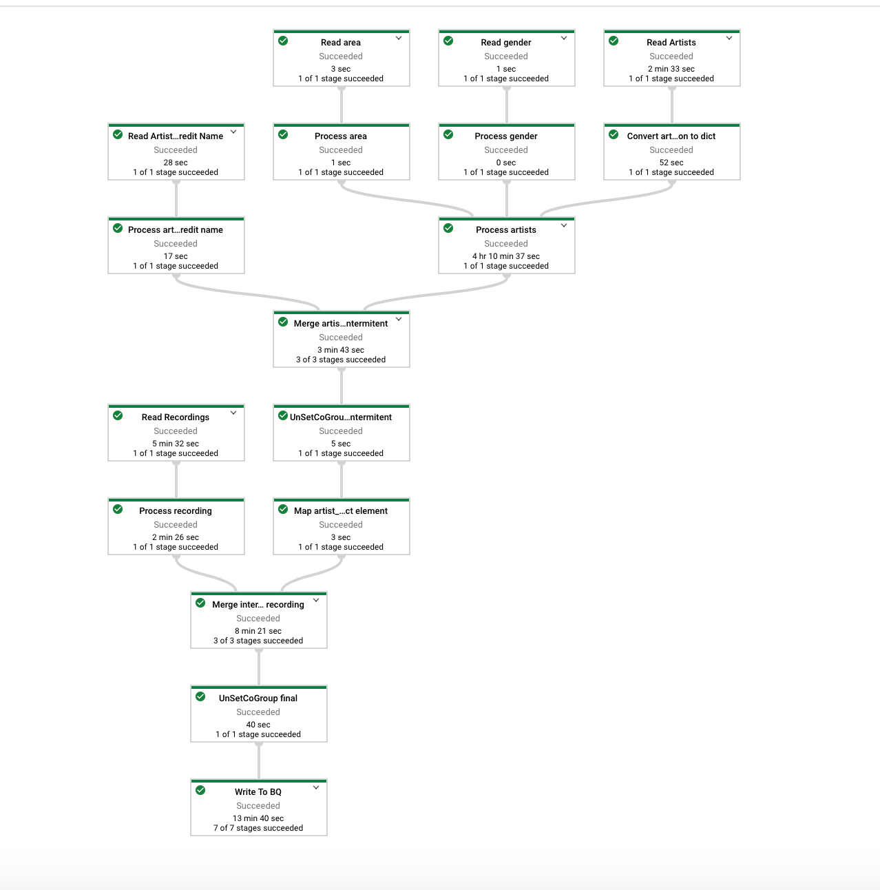

# bigquery-etl-dataflow-sample
This code is addition to the example described in Google tutorial [Performing ETL from a relational database into BigQuery
using Dataflow](https://cloud.google.com/solutions/performing-etl-from-relational-database-into-bigquery). The motivation
behind this project is that the example in the tutorial has only Java examples that might be hard to follow for novice
data engineers.

## Prerequisite
1. Create a GCP project
1. Create a BQ dataset called `musicbrainz`
1. Create a GCS bucket
1. Create a service account to be used by dataflow workers  
1. Create a firewall rule that will allow all the traffic between dataflow workers
    * Target Service Account: <dataflow service account created in previous steps
    * Source Filter: 10.0.0.0/8 (or whatever matches your subnetwork)
    * Direction: INGRESS
    * Protocols and Ports: ALL
    * Network: Whatever your VPC name is
1. **Make sure you are running python3.7+**
1. **Make sure python virtual environment is installed**

    
## Running
First create virtual environment and install all the requirements:
1. `virtualenv venv`
1. `source venv/bin/activate`
1. `pip install -r requirements.txt`

Run the pipeline:
```bash
./pipeline.py --project <gcp project created in prerequisites> \
              --dataset musicbrainz \
              --table recordings_by_artists_dataflow \
              --region <subnetwork region> \
              --network <vpc name> \
              --subnetwork regions/<subnetwork region>/subnetworks/<subnetwork name> \
              --service_account_email "dataflow@datafusion-dataproc-tutorial.iam.gserviceaccount.com" \
              --temp_location  gs://<gcs bucket created in prerequisites>/temp_location \
              --staging_location  gs://<gcs bucket created in prerequisites>/staging
```

Example pipeline run:
```bash
./pipeline.py --project datafusion-dataproc-tutorial \
              --dataset musicbrainz \
              --table recordings_by_artists_dataflow \
              --region us-west1 \
              --network big-data \
              --subnetwork regions/us-west1/subnetworks/fusion \
              --service_account_email "dataflow@datafusion-dataproc-tutorial.iam.gserviceaccount.com" \
              --temp_location  gs://datafusion-dataproc-dataflow-tutorial/temp_location \
              --staging_location  gs://datafusion-dataproc-dataflow-tutorial/staging
```

## Result
The pipeline resembles the pipeline in the Google tutorial.


Once the pipeline finishes executing you can compare BQ tables `musicbrainz.recordings_by_artists_manual` and
`musicbrainz.recordings_by_artists_dataflow`.